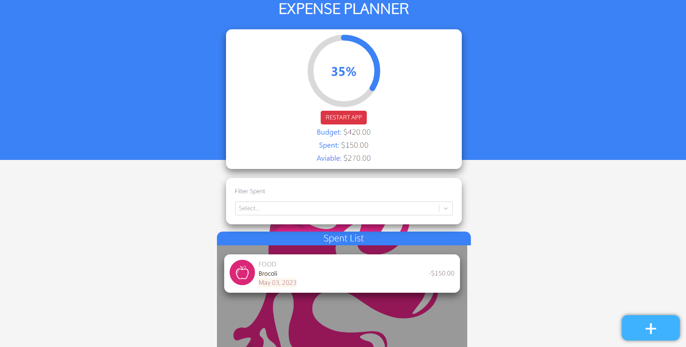
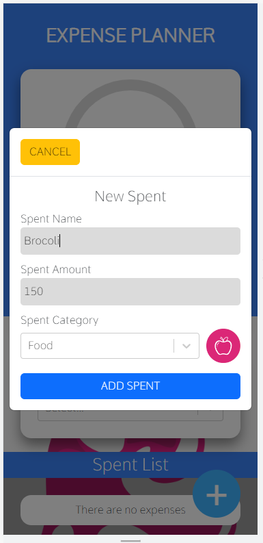

# App_Gestor_Presupuesto_Web
## Easy Planner is a cross platform application created for android and web. It consists of a record of expenses with local storage

## To go to the web application click on the following link:
 
<a href="https://easyplanners.netlify.com">Link to Web App</a>

## To download the Android app click on the image:
 

